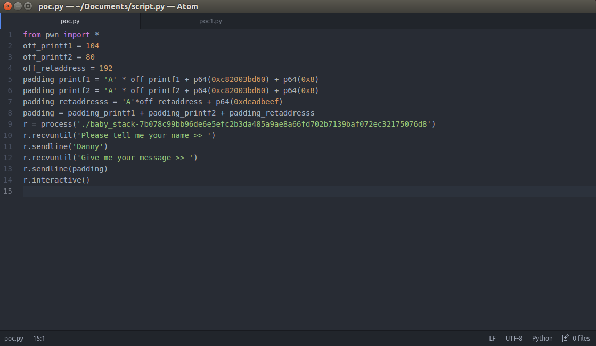
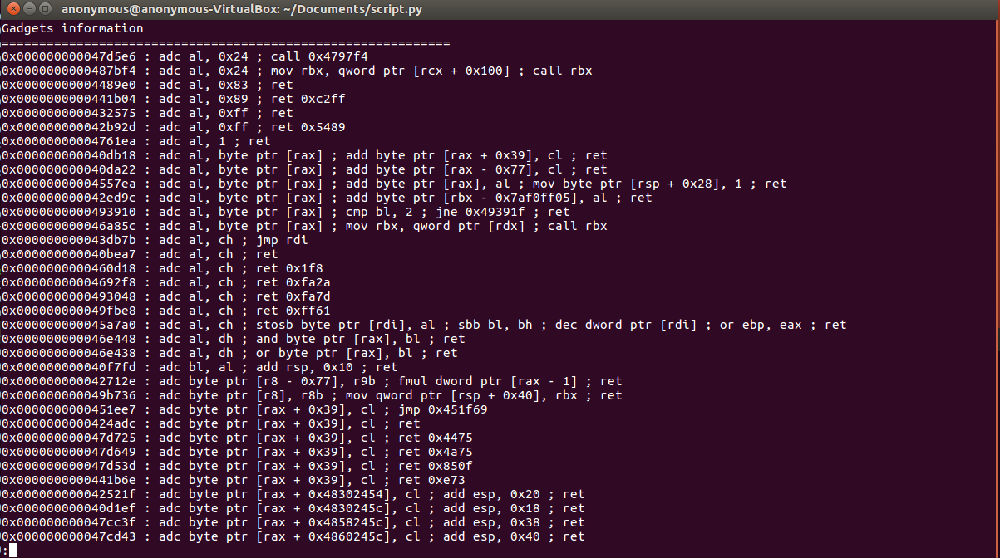
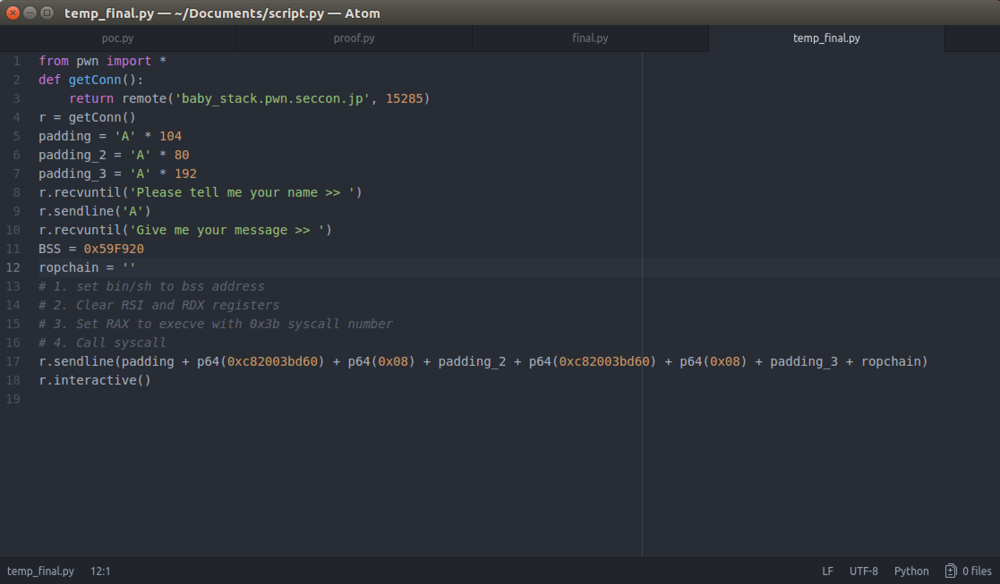
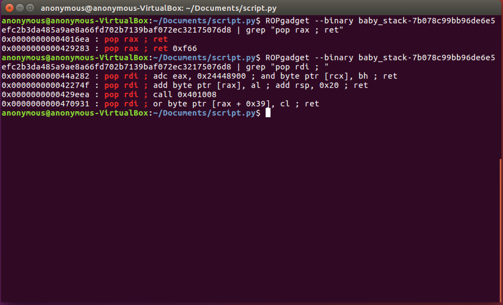
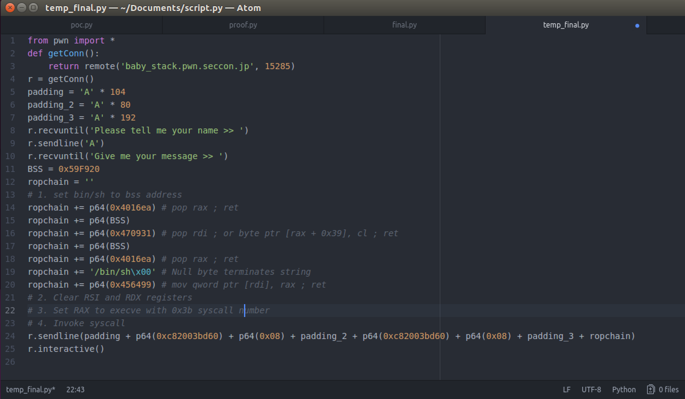
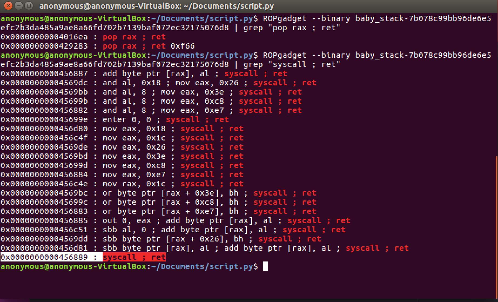
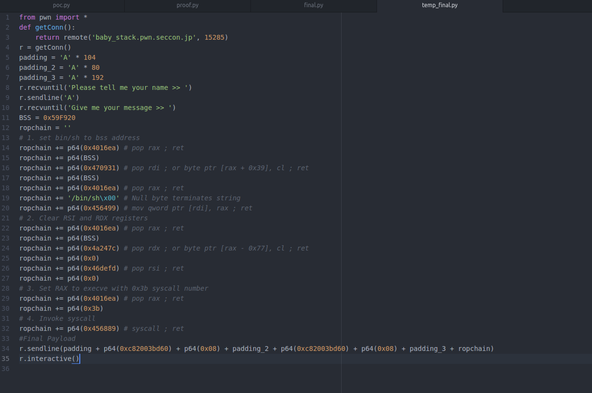
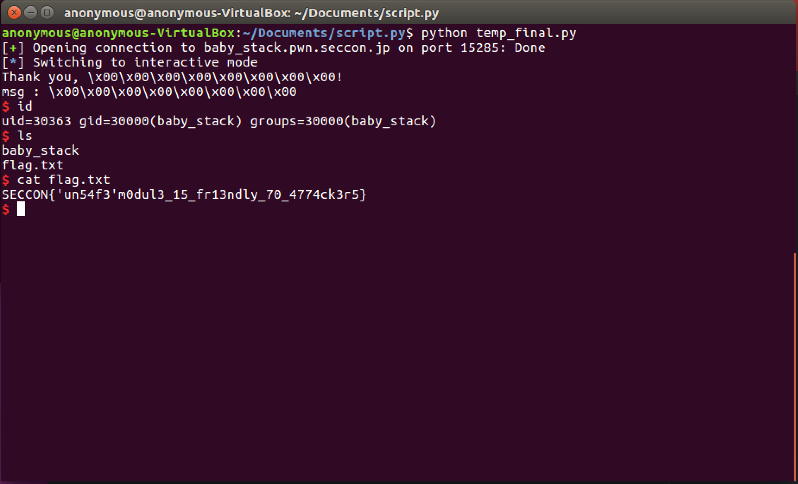

# Smashing the Stack Part 2 - Building the ROP Chain
### By: Danny Colmenares 
#### Twitter: @malware_sec

## Welcome back! 
This is the second part to our Smashing the Stack series. In [Part 1](https://malwaresec.github.io/Stack-Based-Buffer-Overflow/) we focused on controlling execution flow and overwriting our return address using **free and open source tools**. We were able to overwrite the return address of our executable with 0xdeadbeef meaning we had full execution control, now let's use this to call our shell. 

It's important that we fully understand how we developed the exploit in Part 1 because we will be building off it in this writeup by adding in our ROP chain to invoke our shell and get our flag (remember we're using the SECCON CTF [baby_stack](https://github.com/MalwareSec/Stack-Based-Buffer-Overflow/blob/master/baby_stack-7b078c99bb96de6e5efc2b3da485a9ae8a66fd702b7139baf072ec32175076d8.dms) challenge)

This is how our exploit looks so far: 

Just to recap, our first three lines are the offset we use for the padding to our printf functions where we pass an address and how many bytes to read after that address (we picked an arbitrary 0x8 so it reads 8 bytes starting at 0xc82003bd60). We found those offsets using pattern_create and pattern_offset functions (or whichever techniques you feel most comfortable with). 

Our current payload looks like this:

    payload = 'A' * off_printf1 + p64(0xc82003bd60) + p64(0x8) + 'A' * off_printf2 + p64(0xc82003bd60) + p64(0x8) + 'A' * 
    off_retaddress + p64(0xdeadbeef)

In our final payload we will change p64(0xdeadbeef) with our ROP chain to bypass the DEP/NX protection on our executable and invoke our shell: 

Let's talk a bit about why we need this method. So like we briefly discussed in Part 1, we know we have a GO executable with DEP/NX enabled so a traditional ret2libc method or traditional buffer overflows where you set RIP to RSP+offset and immediately run your shellcode won't work. To get around this we use a clever method called Return Oriented Programming (ROP).

This writeup is **not** meant to be a tutorial on Return Oriented Programming (there are much better resources online than anything I could write) but I do want to make sure that we're on the same page about some key concepts and terminology so that our example further down makes sense. The main idea behind Return Oriented Programming is to utilize small instruction sequences available in either the binary or libraries linked to the application called gadgets. 

These gadgets are chained together via the stack, which contains your exploit payload. Each entry in the stack corresponds to the address of the next ROP gadget. Each gadget is in the form of

    instr1; instr2; instr3; ... instrN; ret
    
The ret will jump to the next address on the stack after executing the instructions, thus chaining the gadgets together.
    
There are multiple things that we can do with gadgets. Basically we can execute any instruction if the right instruction sequence is found. For example, if we want to load from memory we could use: 

    MOV RCX, [RAX]; ret
    
This will move the value located in the address stored in RAX, to RCX. 

Another common gadget is storing into memory. For example: 

    MOV [RDI], RAX; ret
    MOV [RAX], RCX; ret

The first example will store the value in RAX to the memory address at RDI. We will use a gadget like this in our example below. 

The [pwntools](https://github.com/Gallopsled/pwntools) ROPgadget library makes it easy for us to enumarate and search through available ROP gadgets (gdb-peda is also a great tool):

    ROPgadet --binary baby_stack-7b078c99bb96de6e5efc2b3da485a9ae8a66fd702b7139baf072ec32175076d8 | less

You'll notice we have 6309 unique gadgets to pick from so we want to make sure we understand which ones we need to complete our exploit. 

So let's jump back into our development. First we want to understand how we will be calling our shell. We will do this by using syscall and execve which both take a few arguments, lets look at syscall first: 

    syscall(RAX, RDI, RSI, RDX)
    
**Remember** syscalls are architecture specific. For example, on x86:

    First you push parameters on the stack
    Then the syscall number gets moved into EAX (MOV EAX, syscall_number)
    Last you invoke the system call with SYSENTER / INT 80
    
The RAX (Accumulator register) will hold the system call number where we will call execve (number 59 or **0x3b** in hexadecimal). Linux syscall table allows us to also call various other useful functions like socket or _sysctl.

The RDI (Destination Index register) argument will point to bin/sh. 

The RSI and RDX (Source Index register and Data register) are additional arguments that we will zero out.

Since PIE (Position Independent Executable) isn't enabled we know that the .bss address won't change from run to run. So this is a great place to store bin/sh in memeory. Let's check our section permissions and check our .bss section address (located adjacent to the data segment).

Using the elfheader flag we find that the .bss segment starts at 0x59f920. This is how our exploit looks so far: 

The last thing we need to do to complete our exploit is make our ROP chain by searching for the gadgets we need. 

Let's start with setting bin/sh to our .bss address. We need to **store** this address in memory (RDI) so we need one of the store gadgets we listed above, specifically:

    MOV [RDI], RAX; ret
    

When we search for this gadget we get

    MOV qword ptr [RDI], RAX ; ret
    
Perfect, now we just need to load our constants into the registers so gadgets like this would do the trick:

    POP RAX; ret
    POP RDI; ret

This will save a value on the stack to a register using the POP instruction for later use. Let's grep for each of these:

We now have everything we need to store bin/sh into our RDI register. The gadgets we will use to store bin/sh in RDI are: 

    POP RDI ; or byte ptr [RAX + 0x39], cl ; ret
    POP RAX ; ret
    MOV qword ptr [RDI], RAX ; ret
    
Two things to remember here: First, we have set RAX to a valid address before we use the first gadget or else we segfault (because the second instruction) and second, we have to terminate our bin/sh with a null byte to terminate our string. 

To summarize what we're doing here, we set RAX to a valid address (our .bss address) then POP our .bss address into RDI and POP '/bin/sh\x00' into RAX. Finally we can MOV our RAX ('/bin/sh\x00') into our RDI (.bss address). 

Our exploit now looks like this:

Now that our RDI points to /bin/sh, let's clear our RSI and RDX registers (set the registers to zero). We can use the same gadgets we described above:

    POP RAX; ret
    POP RDI; ret

But instead of RAX and RDI we need RDX and RSI, let's search for possible gadgets we can use:

Now we just need to set them to zero. This is what our exploit looks like: 

Our final steps are to set 0x3b (execve syscall) into RAX (POP RAX ; ret) and then invoke our syscall (syscall ; ret): 

Let's complete our exploit and run it: 

